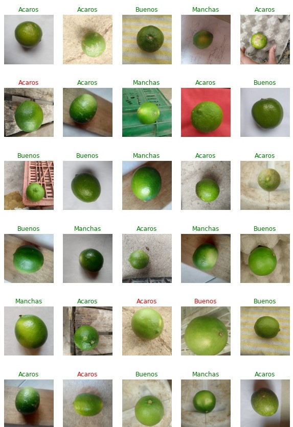
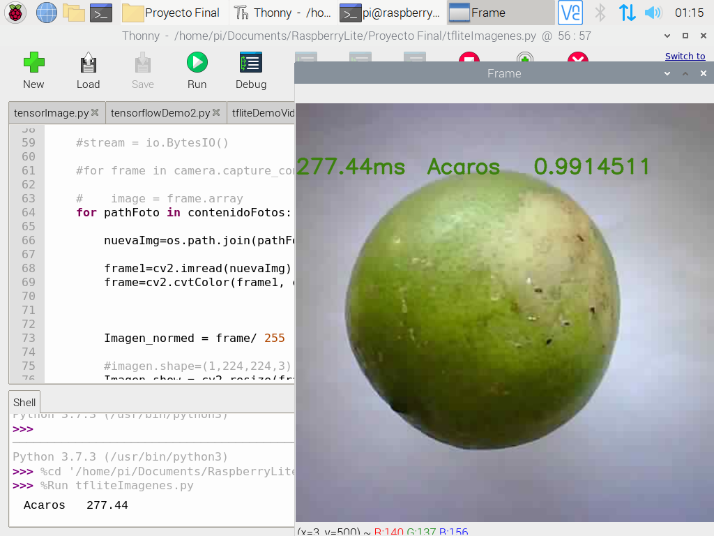

# ClasificacionLimonesCNN
Se plantea la clasificacion de limones Tahiti, teniendo tres caracteristicas, limones buenos(con coloracion uniformemente verde y sin ningun tipo de daños en su cascara), limones con manchas amarillas y limones con acaros(cualquier daño que sea visible en el limon), en el siguiente video se muestra parte del resultado final, realizando la clasificacion utilizando la Raspberry pi 3b+


<p align="center">
   
</p>


En esta imagen se observa el tipo de clasificacion que se realizo en los limones
<p align="center"></p>

Para esto se creo una base de datos de limones con mas de 600 imagenes de cada limon, se entreno una red neuronal **MobilNet v1**  utilizando la tecnica transfert learning, y luego se implementa en un sistema embebido, Raspberry pi 3 b+ y la MAix BiT, con los formatos .tflite y kmodel respectivamente.


## Contenido 
Los documentos adjuntados realizan las siguiente funciones

**Codigo_proyecto_final.ipynb** : Este se divide en varias partes **primero** Toma una carpeta que tenga clasificadas las imagenes de lo limones en 3 categorias, las separa en dataset para Train, Validacion y Prueba. Creando carpetas y llenandolas de la misma cantidad de datos. Luego se guaradn en un .zip **Segundo** Coge o cargar el .zip y estas carpetas creadas (Entrenamiento y Validacion)  las procesa de tal forma que puedan ingresar  a la red neuronal. todo esto mediante funciones de tensorflow.  **Tercero** Escoge el modelo de red neuronal, lo modifica segun la necesidad, entrena y guarda en un  formato deseado. (Aclarar que para el proyecto  se hizo uso del  [framework **aXeleRate**](https://github.com/AIWintermuteAI/aXeleRate) diseñado por Dmitry Maslov  debido a que nos proporciona los modelos en formato necesarios para los sistemas embebidos utilizados)
 
 
 Esta imagen se muestra la exactitud a la hora de clasificar los limones, las etiquetas verdes son las predicciones correctas y las rojas incorrectas
<p align="center"></p>

 
 
 **tfliteDemoVideo.py** : este .py nos permite correr el modelo tflite cargando un Video que se tenga en la Raspberry e ir clasificando cada imagen  video. tenemos que modificar la ruta de donde se encuentra el video, el video debe estar grabado en forma cuadrada 
 
 
**tfliteImagenes.py** : este .py nos permite correr el modelo tflite cargando Imagenes desde alguna carpeta que se encuentre en la Raspberry e ir clasificando cada Imagen. se tiene que modificar la ruta donde se encuentran las imagenes, las imagenes pueden ser de cualquier tamaño pero deben ser cuadradas
 
 
 **tfliteCamara.py**: este .py nos permite correr el modelo cargando imagenes directas desde la camara Picamera.
 
 Los anteriores .py se corren desde la terminal con el siguiente codigo, teniendo en cuenta los path  son del modelo tflite y de las etiquestas en formato txt y el .py se debe correr desde la terminal estando sobre la carpeta donde se encuentra.
 
 ```bash
python3   tfliteCamara.py −−model /home/pi/Documents/ultimo.tflite −−labels /home/pi/Documents/labels.txt 
```

Prueba en la raspberry pi 3b+ para la clasificacion de limones 
<p align="center"></p>


steps:
- title: What is GitHub?
  description: After watching this video, close the first issue in your repository.
  video: https://youtube.com/embed/w3jLJU7DT5E
